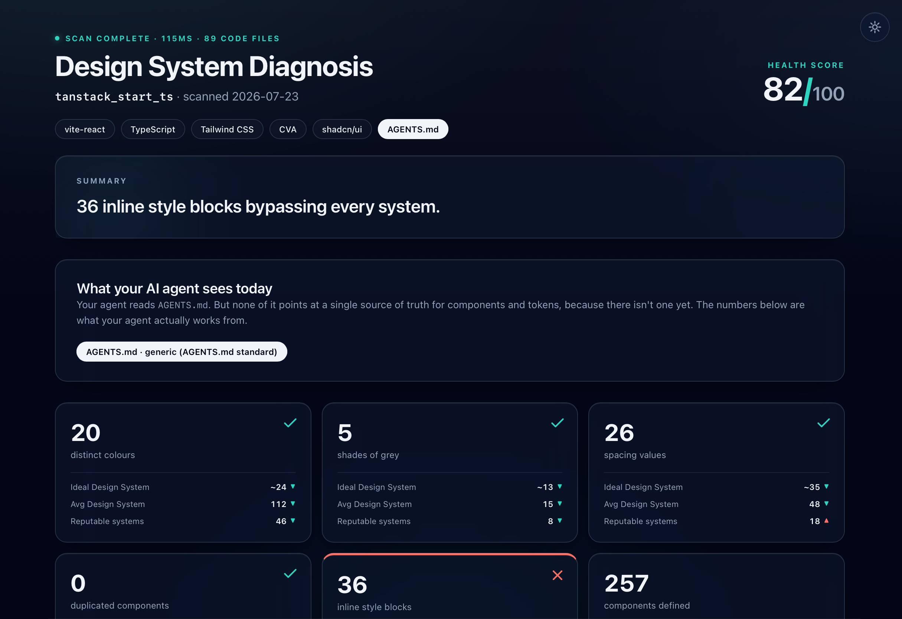
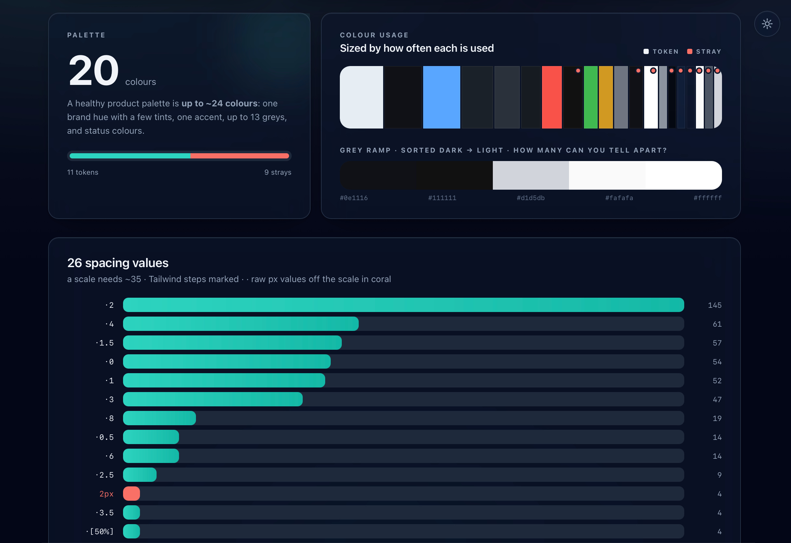
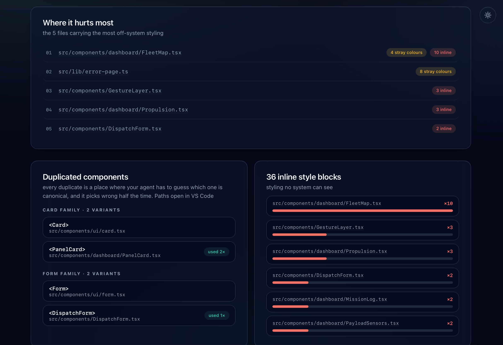
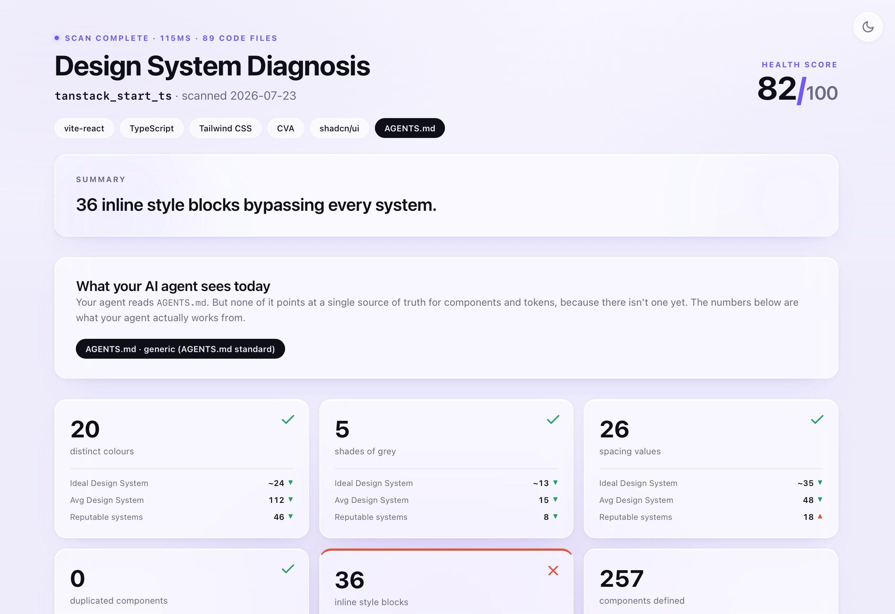

# 🔥 roast-my-design-system

**A Claude Code skill that roasts your repo's design system with real data.**

Run this skill on your codebase and it counts every colour, grey, spacing value, typeface, duplicated component and inline style. Then it compares you against an Ideal Design System, against 27 scanned public repos, and against 10 reputable design systems (Primer, Polaris, Carbon, shadcn/ui…) and generates a shareable HTML diagnosis with real file paths: keep it as a report, or hand it back to Claude as the punch list for the fix.

> *"7 typefaces, brands use 2 or 3. 398 distinct colours, a design system needs ~24. 82 shades of grey doing the job of 13. Messier than the median of 27 scanned repos on 6 of 6 core metrics. And the median repo is already a mess."*
> — the roast of a real, popular open-source repo



<details>
<summary><picture></picture> of the report: the palette forensics, the offender receipts, and the light theme (one file, built-in toggle)</summary>







</details>

## Why this exists

Your AI agent (Claude, Cursor, Copilot) builds UI by imitating what's already in your repo. If your repo has 112 colours and four Button implementations, your agent guesses which one is canonical, and it picks wrong half the time. That's why AI-generated UI looks *almost-but-not-quite* right. The first step to fixing it is seeing the mess measured.

## What makes the numbers trustworthy

- **Deterministic scanner, not AI sampling.** A zero-dependency Node script reads *every* file (a 5,000-file monorepo takes ~1.5s) and returns the same numbers every run. Claude narrates; it never counts.
- **Read-only.** Nothing in your repo is modified. The only outputs are a temp JSON and the HTML report.
- **No network, no telemetry.** Everything runs locally. Nothing about your code leaves your machine.
- **Honest exclusions.** Test files, Storybook stories, and email templates (which *must* inline styles) are excluded, so you can't discredit the numbers on a technicality.
- **A real benchmark.** The "Avg Design System" yardstick comes from scanning 27 public React repos (cal.com, excalidraw, outline, twenty, dub, langfuse…). Median: 112 colours, 15 greys, 48 spacing values, 19 duplicated components.
- **A second yardstick: reputable systems.** Curated, scoped scans of 10 well-known design systems (shadcn/ui, Primer, Polaris, Carbon, Material UI, Chakra, Ant Design, GOV.UK, Spectrum, Cloudscape) show what disciplined looks like at scale.

## Install

**Claude Code (recommended):**

```bash
/plugin marketplace add pencilrebel/roast-my-design-system
/plugin install roast-my-design-system@roast-my-design-system
```

If those commands error, your Claude Code is likely older than the plugin marketplace feature: update Claude Code and retry, or just use the manual route below (it works everywhere and installs the same skill).

**Manual (Claude Code, any version):**

```bash
git clone https://github.com/pencilrebel/roast-my-design-system.git
cp -r roast-my-design-system/skills/roast-my-design-system ~/.claude/skills/
```

(Use `.claude/skills/` inside a repo instead to share it with your team.)

**OpenAI Codex CLI** (same SKILL.md, same folder):

```bash
git clone https://github.com/pencilrebel/roast-my-design-system.git
cp -r roast-my-design-system/skills/roast-my-design-system ~/.codex/skills/
```

Invoke with `$roast-my-design-system` (or let Codex auto-match it). Use `.codex/skills/` inside a repo to share with your team.

**`npx skills`:** `npx skills add pencilrebel/roast-my-design-system` works for agents that read `~/.agents/skills/`. Claude Code currently reads `~/.claude/skills/`, so prefer one of the routes above.

Requires Node 18+.

## Use

Open Claude Code in the repo you want roasted and type:

```
/roast-my-design-system
```

You get the roast in chat plus `design-system-roast.html` at your repo root: a self-contained page (open it, Slack it, email it, no external requests) with:

- a **health score** computed from how your numbers sit against the ideal
- stat tiles comparing you to all three yardsticks: Ideal, the 27-repo average, and the reputable systems
- a **light/dark theme toggle** in one file
- the usage-weighted palette bar, the grey ramp, the spacing scale, the duplicate-component receipts with clickable file paths, and the worst-offenders ledger

## What it measures

| Metric | Ideal Design System | Median of 27 scanned repos | Median of 10 reputable systems |
|---|---|---|---|
| Distinct colours | ~24 | 112 | 46 |
| Shades of grey | up to 13 | 15 | 8 |
| Spacing values | ~35 | 48 | 18 |
| Typefaces | 2–3 | 0 declared | 1 |
| Border radii | up to 10 | 12 | 2 |
| Duplicated components | 0 | 19 | 10 |
| Inline style blocks | 0 | 116 | 23 |

Yes, the median repo is already a mess. That's the point.

## License

MIT

Built and designed by [Greg Kozakiewicz](https://gregkozakiewicz.com).
